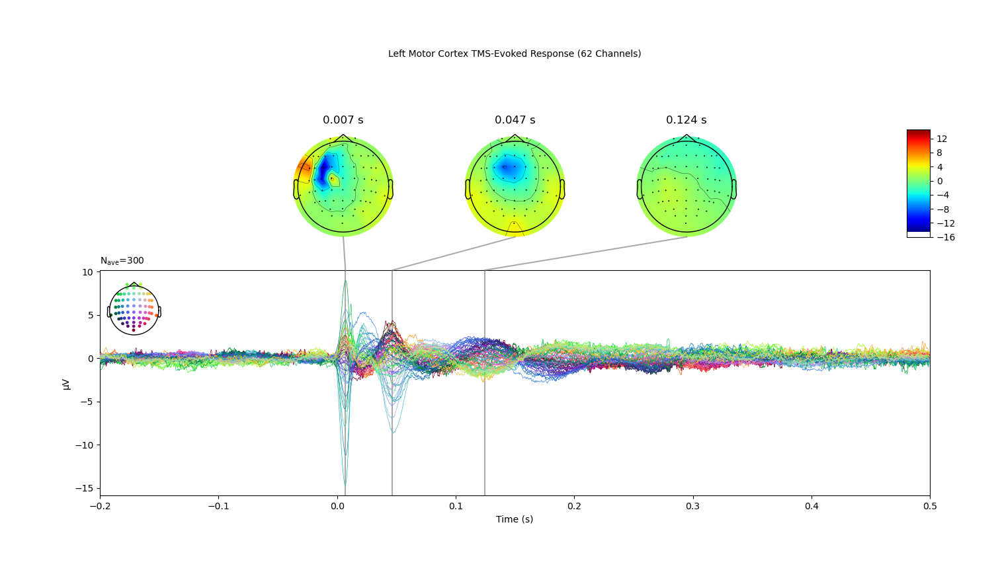

# TMS-EEG Preprocessing Python Tutorial

Welcome to this tutorial on preprocessing EEG data! This guide is designed to help those familiar with EEG and TMS/EEG concepts, but who may be new to Python programming. We're going to walk through the preprocessing steps needed to transform raw TMS/EEG data into a format ready for further analysis.

During this tutorial, we will:

1. [Importing Required Libraries](#step-1-import-required-libraries)
2. [Find Raw TMS/EEG Data Path](#step-2-find-eeg-data-path)
3. [Load Data, Create and Inspect an `mne.Raw` Object](#step-3-load-raw-data-create-an-mne-raw-object-and-inspect-the-data)
4. [Handle Events and Remove TMS artifacts using a Custom Function](#step-4-handle-events-and-remove-tms-artifacts-using-a-custom-function)
5. [Basic Preprocessing](#step-5-basic-preprocessing)
    - Apply Detrend (Under development)
    - Highpass Filter (1 Hz)
6. [Create `mne.Epochs` objects by segmenting the continuous data](#step-6-epoching)
7. [Inspect the Epochs](#step-7-inspecting-epochs-for-bad-channels-or-trials)
8. [Further Pre-processing](#step-8-futher-preprocessing)
    - Apply Low Pass Filter (45 Hz)
    - Downsample (1000 Hz)
9. [Apply Average Reference](#step-9-re-reference-to-the-average)
10. [Apply Baseline Correction](#step-10-baseline-correction)
11. [Interpolate Bad Channels](#step-11-interpolate-bad-channels)
12. [Create `mne.Evoked` object through averaging](#step-12-creating-an-evoked-response)

Each step will include a code snippet and an explanation of what the code does. Along the way, we will pose some thought-provoking questions, share useful tips, and ensure that you not only know *how* to preprocess EEG data, but also *why* each step is important.

Let's get started!

## Step 1: Import Required Libraries

Before we dive into the data processing, we need to import several Python libraries. These libraries provide the functions and methods we'll use to load, manipulate, and visualize the data. We'll be using:

- `mne`: MNE-Python is an open-source library for processing and visualizing M/EEG data.
- `mne.preprocessing`: This module from MNE-Python provides functions for preprocessing the data, such as the `ICA` function we'll use later.
- `numpy`: A fundamental package for scientific computing in Python. We'll use it for various calculations and data manipulations.
- `scipy`: A library used for scientific and technical computing. We'll use it for interpolation and signal filtering.
- `os`: This standard Python library provides functions for interacting with the operating system, including file I/O operations.
- `scipy.io`: A module in SciPy used for reading and writing various data formats. We'll use the `loadmat` function to load MATLAB files.

Here's the code to import these libraries:

```python
# Imports
import mne
from mne.preprocessing import ICA

import numpy as np
from scipy import interpolate

import os
from scipy.io import loadmat

import matplotlib.pyplot as plt
import matplotlib
matplotlib.use('Qt5Agg')
```

## Step 2: Find EEG Data Path

We'll start by loading the raw EEG data and the information about the channel locations. 

We first specify the directory path where our EEG data files are located. In this example, it's stored in the `DATA_PATH` variable.

Next, we look for all files in that directory that end with the extension '.vhdr' (these are Brain Vision data files). We select the first file found with this extension. This will be the file we load for our analysis.

Here's how you can do it:


```python
# Define the directory (folder path) where your data files are stored
DATA_PATH = 'INSERT THE PATH TO YOUR DATA FOLDER HERE'

# List all files in the directory and select the first one ending with '.vhdr'
file = [f for f in os.listdir(DATA_PATH) if f.endswith('.vhdr')][0]
```

## Step 3: Load Raw Data, Create an MNE Raw Object and Inspect the Data

Once we have our EEG data and channel locations loaded, the next step is to create an MNE Raw object. This object is the basic container for continuous M/EEG data in MNE-Python. We load our EEG data into this object, specifying the name of our EOG channels ('VEOG', 'HEOG') and preloading the data into memory for further processing.

After creating the Raw object, we rename the channels when needed. In our protocol, the AF7 and AF8 channels were actually respectively placed on AFz and FCz positions. So we will rename them using `rename_channels()` and set the montage to `'standard_1020'`.

Lastly, we plot the raw data for initial inspection. This plot allows us to see the continuous EEG signal across all channels, helping us check wheater the file was correctly loaded and even identify any clear issues or artifacts in the data at first glance.

Let's create the MNE Raw object and visualize the data:

`Question: What are some benefits of visually inspecting your raw data before performing any preprocessing steps?`


```python
# Create an MNE Raw object from the EEG data
# Here, we pass the EOG channels names as the eog parameter, so that MNE knows their names
# We also pass preload=True to load the data into memory right away
raw = mne.io.read_raw(os.path.join(DATA_PATH, file), eog=('VEOG', 'HEOG'), preload=True, verbose=False);

# Rename channels that had their positions changed during recording
raw.rename_channels({'AF7':'AFz', 'AF8':'FCz'})

# Set the montage to the standard 1020 montage
raw.set_montage('standard_1020', verbose=False)
```


```python
# Plot the raw data for inspection
raw.plot()

# Note that there are some large artifacts in the data, which are the TMS pulses
# We can see that the TMS pulses are marked as events in the data
# We can also see that the data is very noisy, so we will need to filter it
```

## Step 4: Handle Events and Remove TMS artifacts using a Custom Function
**Handle Events**

Before removing artifacts from our data, we first need to handle the events embedded in the raw data. Events in M/EEG data are discrete occurrences at specific time points, such as a stimulus being presented or a button being pressed.

In our case, we'll extract all events from the raw data annotations and keep only those with event code 1128.

<span style="color:#1496BB">Question: In an event-related design, such as TMS/EEG protocols, precise event timing is critical for subsequent analysis. What challenges might you encounter in aligning the events from the stimulus presentation system with the EEG data, and how might you overcome these challenges?</span>

**Remove TMS Pulse Artifacts**

Now that we've handled the events, we can move on to removing the TMS pulse artifacts from our raw data.

TMS pulse artifacts are typically high-amplitude, brief distortions in the EEG signal caused by the magnetic field induced by the TMS pulse. These artifacts are usually so large that they can obscure underlying EEG activity, making it necessary to remove them.

We define a function, `remove_tms_pulse_artifact`, which removes data on given onsets (event timings) considering a given window (interpolation window, in samples).

We also define the interpolation window in terms of samples. This window is used later when we interpolate data to replace the artifact-laden segments. The window is defined as 2 ms before the event onset and 5 ms after the onset.

We then apply this function to our raw data using MNE-Python's `apply_function` method, specifying our artifact onset times and interpolation window. Note that we chose to apply it only to EEG channels via the `pick('eeg')` function.

Let's handle the events and remove the TMS pulse artifacts:

<span style="color:#1496BB">Question: Considering the broad range of potential artifacts in EEG data (such as those from eye movements, muscle activity, and external electrical noise), how might you approach identifying which artifact is causing an issue in your dataset? What strategies might you use to separate artifact from true neural signal?</span>


```python
# Dealing with Events

# Extract events from raw data annotations
events, _ = mne.events_from_annotations(raw) # This function returns the events array and the event_id dictionary
# The events array has 3 columns: sample number, 0 and event code

# Filter events to keep only those with event code 1128
events = events[events[:, 2] == 1128]
```


```python
# Removing TMS Artifact on Raw

# Define a function to remove TMS pulse artifact and interpolate data
def remove_tms_pulse_artifact(y, onsets, interp_window):
    """
    Remove data from y between the indices (onset+x1) and (onset+x2) for each onset, 
    and interpolate across this gap.
    This function assumes that the y values correspond to equally spaced x values.
    """
    # Extract the start and end points of the interpolation window
    x1, x2 = interp_window

    # Create a copy of y to avoid modifying the original data
    y_new = y.copy()
    
    # Create corresponding x-values
    x = np.arange(len(y))

    # Loop over each onset
    for onset in onsets:
        # Check if the window is valid
        if not 0 <= onset+x1 < onset+x2 < len(y):
            raise ValueError(f"Invalid window for onset {onset}")

        # Make sure we have enough points for cubic interpolation
        if onset+x1 < 2 or onset+x2 > len(y) - 3:
            raise ValueError(f"Not enough points for cubic interpolation at onset {onset}")

        # Include two points on either side of the gap
        x_for_interpolation = np.concatenate((x[onset+x1-2:onset+x1], x[onset+x2+1:onset+x2+3]))
        y_for_interpolation = np.concatenate((y_new[onset+x1-2:onset+x1], y_new[onset+x2+1:onset+x2+3]))

        # Use cubic interpolation to create new y-values for the window
        f = interpolate.interp1d(x_for_interpolation, y_for_interpolation, kind='cubic')
        y_new[onset+x1:onset+x2+1] = f(x[onset+x1:onset+x2+1])

    return y_new

# Get the sampling frequency from raw data information
sfreq = raw.info['sfreq']

# Define the interpolation window in terms of samples
interp_window = (int(-0.002*sfreq), int(0.005*sfreq)) # -2ms to +5ms around the TMS pulse onset, in samples

# Apply the function to remove TMS pulse artifacts and interpolate data
raw.pick('eeg').apply_function(remove_tms_pulse_artifact, onsets=events[:, 0], interp_window=interp_window, verbose=False);
```

## Step 5: Basic Preprocessing
**Detrend and Highpass Filter**

Before we proceed to segment the continuous EEG data into epochs, we first need to preprocess the data. The steps involve detrending and filtering. Detrending is to remove the linear trend from the data, filtering is to keep the frequency content of the data within a desired range.

<span style="color:#1496BB">Question: Why might it be important to detrend and/or filter our data before proceeding with further analysis? What could be the potential impacts of the data if we don't do this preprocessing step?</span>


```python
# Apply Detrending
# NEED TO IMPLEMENT

# Apply a Butterworth filter (filt-filt) with high-pass at 1 Hz
raw.filter(l_freq=1, h_freq=None, method='iir')
```

## Step 6: Epoching

Now that our data are in a cleaner state, we can proceed to segment the continuous EEG data into epochs, which are shorter segments of data surrounding an event of interest.

<span style="color:#1496BB">Question: Why do we divide our continuous EEG data into epochs? How would you decide the suitable time window for epoching?</span>


```python
# Step 6: Epoching

# Segment the continuous data into epochs, from -800 ms to 800 ms around the event onsets
epochs = mne.Epochs(raw, events, tmin=-0.8, tmax=0.8, preload=True, baseline=None)
```

## Step 7: Inspecting Epochs for Bad Channels or Trials

When working with EEG data, one crucial step in preprocessing is inspecting the epochs for bad channels or trials. This step involves a detailed visual inspection of the epochs to identify channels or trials that contain excessive noise or artifacts, often due to hardware malfunctions, bad electrode contact, or non-neural physiological activities.

Bad channels can be characterized by a consistent, extreme difference in signal amplitude compared to the other channels. They might appear as flat (indicating a lost or disconnected electrode) or excessively noisy (possibly due to a poor electrode-skin contact).

Similarly, bad trials may contain excessive artifacts that occur due to participant movements, blinks, or other temporary disruptions. These trials will have atypical and potentially extreme values at any channel when compared to the majority of trials.

It's important to note that the decision to label a channel or trial as "bad" often requires expert judgment. However, some general guidelines can help. For instance, if a channel exhibits a flat signal, extreme noise, or non-physiological activity patterns consistently across trials, it's likely a bad channel. On the other hand, if only certain trials show such behavior, then these are probably bad trials.

Upon identifying these bad channels and trials, the next step is to decide what to do with them. There are several options, including:

Interpolation: Bad channels can be interpolated from the nearby 'good' channels to estimate what the signal at the bad electrode might have been.
Exclusion: Both bad channels and trials can simply be excluded from further analysis. This is a straightforward approach, but it reduces the amount of data available.
Correction Methods: Certain methods can correct artifacts in bad trials, such as regression methods or signal-space projection. These can be quite effective but are also more complex.
By effectively managing bad channels and trials, we can ensure the highest possible data quality for subsequent analyses.
In our case, we will interpolate the bad channels.

Remember: Always consider the impact of your decisions at this stage on the later stages of your analysis pipeline. This will help to ensure the integrity and reproducibility of your results.

<span style="color:#1496BB">Question: One of the key challenges in EEG analysis is deciding how to handle bad channels and trials. If you discover that a significant proportion of your data is "bad" (e.g., more than 30% of your channels or trials), how might this influence your analysis strategy? Would you reconsider your experimental protocol or the data acquisition setup? Why or why not?</span>


```python
# Inspecting Epochs
epochs.plot(n_epochs=3, precompute=True, use_opengl=True, theme='dark', block=True);
```

## Step 8: Futher Preprocessing

After segmenting the continuous EEG data into epochs, we will perform additional preprocessing steps on these epochs. These steps include:

- Filtering: Similar to what we did with the continuous data, we apply a filter to the epoched data to remove high-frequency noise. Here we are using a high-frequency cutoff of 45 Hz, which helps us eliminate higher frequency artifacts and noise that are not relevant for our analysis.
- Downsampling: Downsampling is a process of reducing the sampling rate of the signal. This reduces the size of the data and can improve computational efficiency in subsequent analyses. Note that downsampling should only be done after applying a low-pass filter to prevent aliasing.
- Cropping: Finally, we crop our epochs. This process trims the epoch window to a specified length. In our case, we are keeping a time window from -0.6 to 0.6 seconds around the event. Cropping can be particularly helpful in removing edge artifacts that might have been introduced during filtering.

<span style="color:#1496BB">Question: The trade-off between data integrity and computational efficiency is a common challenge in EEG analysis. For instance, downsampling reduces data size and computational load but might also eliminate potentially valuable high-frequency information. Similarly, cropping epochs can remove edge artifacts, but also reduces the temporal context for each epoch. Given these trade-offs, how would you approach the decision-making process when setting parameters such as filter cut-offs, downsampling rates, and crop intervals? How might your specific research question influence these decisions?</span>

Here is the Python code that implements these steps:


```python
# Applying Low-Pass Filter using IIR (Butterworth filt-filt)
epochs.filter(l_freq=None, h_freq=45, method='iir')

# Downsampling
epochs.resample(1000)

# Cropping Epochs
epochs = epochs.crop(-0.6, 0.6)
```

## Step 9: Re-reference to the Average

EEG signals are always recorded as a difference between two electrodes, the 'active' electrode and the 'reference' electrode. The choice of reference can have a significant impact on the recorded EEG signals. Here, we re-reference the EEG data to the average of all electrodes.

<span style="color:#1496BB">Question: What is the significance of re-referencing in EEG data analysis? How might different reference choices influence the analysis results?</span>


```python
# Apply average reference to the data
epochs.set_eeg_reference('average', projection=True)
epochs.apply_proj();
```

## Step 10: Baseline Correction

Baseline correction is a standard processing step in EEG analysis that adjusts the data based on the average signal value during a baseline period. Here, we use the period from -600 ms to -1 ms as the baseline.

<span style="color:#1496BB">Question: What is the purpose of applying a baseline correction in EEG analysis? What factors would you consider when selecting the baseline period?</span>


```python
# Apply baseline correction using the time window from -600 ms to -1 ms
epochs.apply_baseline((-0.6, -0.001), verbose=True);
```

## Step 11: Interpolate Bad Channels

Occasionally, some channels may provide poor quality signals due to various reasons, such as poor contact with the scalp or hardware problems. In such cases, we can interpolate these bad channels using the signals from the surrounding good channels.

<span style="color:#1496BB">Question: What are some potential causes of 'bad' channels in EEG data? How does the interpolation of bad channels help in EEG data analysis?</span>


```python
# Interpolate Bad Channels 
epochs.interpolate_bads(reset_bads=True, verbose=True)

# Note: This function uses spherical spline interpolation by default.
```

## Step 12: Creating an Evoked Response

Finally, we compute the average of all epochs to create an evoked response, which represents the brain's average response to the given event. We then plot the evoked response and its topographic representation.

<span style="color:#1496BB">Question: What information can the evoked response provide us in an event-related potential study? Why do we take an average across trials to create an evoked response?</span>


```python
# Creating an Evoked Response

# Compute the average of all epochs to create an evoked response
evoked = epochs.average().crop(-0.2, 0.5)

# Plot the evoked response and some topographies representation
evoked.plot_joint(topomap_args=dict(cmap='jet'));
```

# Done!
By the end of this notebook you should be able to obtain clear `mne.Epochs` and `mne.Evoked` objects and a figure that represents the preprocessed TMS Evoked Potential as below.




